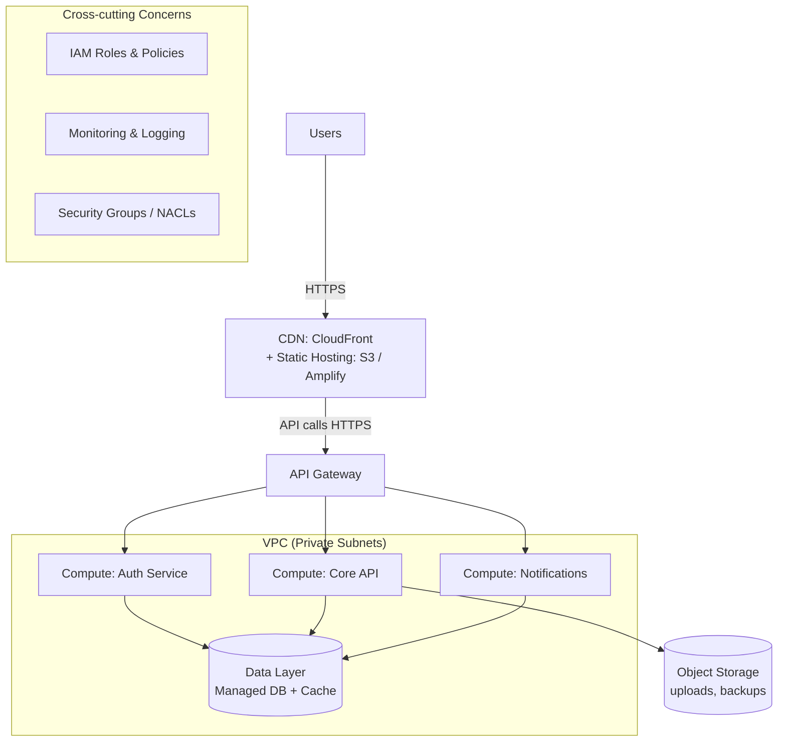

# Cloud Architecture Outline
### Task 1 — SWYNEX Cloud Internship
**Workload Type:** Web Application with REST API Backend
**Cloud Provider Reference:** AWS (concepts apply equally to Azure / GCP)

---

## 1. Overview

This document describes a conceptual cloud architecture for a typical **web application with an API backend** — for example, a task-management app or an e-commerce storefront. The design follows a standard 3-tier pattern (presentation, application, data) and covers four required areas: **Compute, Storage, Networking, and Identity**.

---

## 2. Architecture Diagram (Conceptual)

*This renders as an interactive diagram on GitHub automatically (GitHub supports Mermaid natively in `.md` files). If viewing elsewhere and it still shows as plain text, paste the code block into [mermaid.live](https://mermaid.live) to preview/export it as an image.*

---

## 3. Compute

| Layer | Service (AWS example) | Purpose |
|---|---|---|
| Frontend hosting | S3 static hosting / Amplify | Serves the compiled web app (HTML/JS/CSS) |
| API/backend logic | Lambda (serverless) or ECS/Fargate (containers) | Executes business logic, stateless and horizontally scalable |
| Background jobs | Lambda + EventBridge/SQS | Handles async tasks like email/notifications |

**Design choice rationale:** Serverless (Lambda) is used for unpredictable or spiky traffic since it scales automatically and has no idle cost. For workloads needing longer-running processes or custom runtimes, containers on Fargate are the alternative — no server management either way.

---

## 4. Storage

| Type | Service (AWS example) | Purpose |
|---|---|---|
| Relational data | RDS (PostgreSQL/MySQL) | Structured data: users, orders, transactions |
| Caching | ElastiCache (Redis) | Session storage, reducing DB load |
| Object storage | S3 | User-uploaded files, static assets, backups |
| Backups | S3 + automated RDS snapshots | Disaster recovery |

**Design choice rationale:** Data is split by access pattern — transactional data goes to a managed relational DB for consistency, frequently-read data is cached, and unstructured files (images, documents) go to cheap, durable object storage rather than the database.

---

## 5. Networking

| Component | Service (AWS example) | Purpose |
|---|---|---|
| Isolation boundary | VPC (Virtual Private Cloud) | Logically isolates all resources |
| Subnets | Public + Private subnets | Public subnet hosts load balancer/API Gateway; private subnets hold compute and database (not internet-facing) |
| Traffic routing | Application Load Balancer / API Gateway | Distributes incoming requests, handles SSL termination |
| Content delivery | CloudFront (CDN) | Caches static content close to users, reduces latency |
| Access control | Security Groups + NACLs | Firewall rules at instance and subnet level |

**Design choice rationale:** Compute and database resources sit in **private subnets** with no direct internet access — the only entry points are the load balancer/API Gateway in the public subnet. This follows the principle of minimizing the attack surface.

---

## 6. Identity & Access Management

| Concern | Service (AWS example) | Purpose |
|---|---|---|
| End-user authentication | Cognito (or Auth0/Firebase Auth) | Sign-up/sign-in, JWT token issuance |
| Service-to-service access | IAM Roles | Each compute service gets a role with least-privilege permissions (e.g., API service can read/write to its own DB table only, not all resources) |
| Admin access | IAM Users/Groups + MFA | Human access to the cloud console, protected with multi-factor authentication |
| Secrets management | Secrets Manager / Parameter Store | Stores DB credentials, API keys — never hardcoded in code |

**Design choice rationale:** Identity is split into two planes: **end-users** authenticate via a managed identity service (Cognito), while **backend services** use IAM roles scoped to only the permissions they need (least privilege), rather than a single shared admin credential.

---

## 7. Summary of Key Design Principles

1. **Separation of concerns** — presentation, compute, and data layers are decoupled.
2. **Least privilege** — every component has only the access it needs, nothing more.
3. **Private-by-default networking** — only the load balancer/API layer is internet-facing.
4. **Managed services over self-hosted** — reduces operational overhead (patching, scaling).
5. **Stateless compute** — allows horizontal scaling and resilience to instance failure.

---

*This architecture is provider-agnostic in concept: AWS services shown above map directly to Azure (App Service/Functions, Blob Storage, VNet, Azure AD) or GCP (Cloud Run/Functions, Cloud Storage, VPC, IAM) equivalents.*
